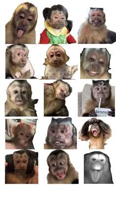
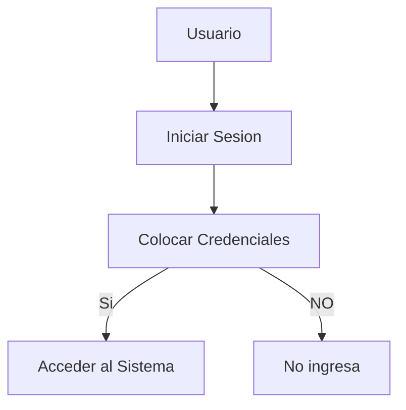

# Aprendiendo Markdown
El día de hoy vamos a "aprender" a usar el Markdown aquí en Tecsup.

## Subtítulo 01
Esto es un simple subtítulo en el cual coloca un **texto**.

### Subtítulo 02
Aprendiendo a crear subtítulos en ~~Markdown en TECSUP con los chicos de teoría~~.

## Instalación 
1. Creamos la carpeta
2. Iniciamos Git Hub
3. Ubicamos los archivos

[Visita TECSUP](https://www.tecsup.edu.pe)

## para códigos
```html
    <h1>Esto es un codigo</h1>
```

```css
    body{
        background: darkblue;
    }
```

```java
    public class Main{
        public static void main(String[] args) (
            System.out.print("Aprendiendo hoy");
        )
    }
```

## Colocando imágenes


## Diseño de Botones


## Funciones 
- [X] Registro de Alumno
- [X] Matricula Procesada
- [ ] Reporte Generado 

## Creando tablas 
| Lenguajes de Programación | Creador |
|---------------------------|---------|
| Java | James Gosling |
| PHP  | Rasmus Lerdorf |

| Programas | Año de Creación |
|-------------------------------------|
| Visual Studio CODE | 2004 |
| Virtual Box | 2006 |

## Aprendiendo mermaid
